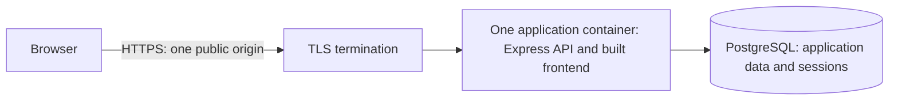

# bandOS containerization audit and implementation plan

Status: Approved architecture; [ticket 01 implementation](tickets/containerization/01-runtime-configuration-security.md) is completed in [merged PR #63](https://github.com/CaelanRT/bandos/pull/63). Later containerization/deployment work remains pending.

Audit date: 2026-10-06. Repository baseline: `3dd419a` on `main`.

Deployment clarification: AWS instance hosting, registry-published images, eventual GitHub Actions CI/CD, fresh staging data, and promotion of the same application image to production; Express serves the built frontend and API in one container.

## 1. Goal and scope

Package the current frontend and backend into one reproducible deployment image, with a documented way to start the complete application and preserve its PostgreSQL data. Keep existing authentication, API contracts, and product behavior intact.

This document is an audit and ticket-planning input. It does not implement containers or provision infrastructure. Target an AWS instance (assumed EC2) running Docker Compose; confirm instance architecture and networking before deployment. GitHub Actions will eventually build, verify, and publish the application image to a container registry. Amazon ECR is the proposed registry, subject to confirmation. Kubernetes, autoscaling, Redis, product changes, and a broad application refactor are outside this initial effort.

Staging starts with a new database; no local data migration is required. Build each release once and promote the same application image digest to production. Staging and production have separate runtime settings, secrets, and persistent databases; promoting the image does not copy staging data.

## 2. Current application audit

The implementation is the source of truth where older specifications differ.

| Area | Current evidence | Deployment consequence |
| --- | --- | --- |
| Frontend | [package.json](../frontend/package.json): React 19, React Router 7, TanStack Query, Vite 8; `npm run build` produces `dist/`. | Build with Node; serve the result as static files through Express. Neither Vite development nor preview is the production server. |
| Node compatibility | [frontend lockfile](../frontend/package-lock.json): Vite requires `^20.19.0 || >=22.12.0`; jsdom requires `^20.19.0 || ^22.13.0 || >=24.0.0`. Neither application pins Node. | Select a supported LTS version compatible with both applications and tests; proposed baseline is Node 24 on Debian slim. |
| Frontend configuration | [config.js](../frontend/src/config.js) requires nonempty `VITE_API_ORIGIN` and appends `/api/v1`; [vite.config.js](../frontend/vite.config.js) validates it before a non-test build. | Configuration is baked into the bundle. The current function also accepts `/`, yielding relative `/api/v1`; explicitly document and test this same-origin option for reusable images. Do not supply `/api/v1` in this value. |
| Routing and assets | [routes.jsx](../frontend/src/app/routes.jsx) uses browser routing; fonts are bundled locally under `src/assets/fonts/`. | Direct requests and refreshes on nested UI paths need an `index.html` fallback. API paths and missing assets must not return that fallback. |
| Browser transport | [client.js](../frontend/src/api/client.js) sends `credentials: 'include'`. | The browser needs a reachable public URL, never a Compose service name such as `backend`. |
| API process | [backend/package.json](../backend/package.json) starts `node app.js`; [app.js](../backend/app.js) listens on `PORT` or 3000. It has no compilation step. | Install production dependencies and run Node directly using an exec-form command, as a non-root user. |
| Native dependency | Backend uses bcrypt 6. | Install bcrypt inside the image for the selected OS and CPU architecture; never copy host `node_modules`. Verify hashing in the built image. |
| HTTPS and proxy | Production sets `trust proxy` to 1 and rejects requests unless `req.secure`, before mounting any route. | A plain HTTP container health probe gets `426`, including `/api/v1/health`. The trusted proxy configuration must match the actual deployment hops. |
| Authentication | PostgreSQL-backed `bandos.sid`, HttpOnly, SameSite=Lax, Secure in production, rolling seven-day expiry; `CLIENT_ORIGIN` controls credentialed CORS. | Prefer one public HTTPS origin for UI and API. Keep `SESSION_SECRET` stable across redeployments so existing sessions remain usable. |
| Runtime configuration | [app.js](../backend/app.js), [db/index.js](../backend/db/index.js), and [auth.controller.js](../backend/controllers/auth.controller.js) consume environment variables without centralized validation. Registration passes `Number(BCRYPT_ROUNDS)` directly into bcrypt. | Validate required settings and document defaults. Missing hash cost cannot be treated as the specification's stated default of 12. |
| Configuration documentation | Frontend tracks [.env.example](../frontend/.env.example). Backend does not track an example despite the scaffold specification referring to one. Both ignore local `.env`. | Add a secret-free backend example and deployment configuration reference. Git ignores do not protect Docker build contexts. |
| Database | A single `pg` pool uses five `DB_*` connection variables. `DB_SSL=true` enables TLS with `rejectUnauthorized: false`. | `localhost` will not reach a separate database container. Remote database TLS currently does not verify server identity and needs a verified-CA option before production use. |
| Schema and sessions | [schema.sql](../backend/db/schemas/schema.sql) creates enums, users, bands, memberships, events, and the `session` table. Session-store auto-creation is disabled. SQL is not safe to reapply to an existing database. | Establish schema before serving traffic. Bootstrap a fresh staging database once; retain initialized databases across redeployments. Never run this SQL on every API startup. |
| Health | [health.controller.js](../backend/controllers/health.controller.js) runs only `SELECT 1`, returning 200 or 503. | Useful dependency readiness check, but it does not prove application tables exist. Schema initialization must have its own completion gate. |
| Shutdown | API does not retain its server handle or handle SIGTERM/SIGINT. [db/index.js](../backend/db/index.js) already exposes `close()` but it is unused at shutdown. | Drain HTTP requests and close the pool within a bounded stop period. |
| Rate limiting | [auth.routes.js](../backend/routes/auth.routes.js) uses default in-process stores: five registrations/hour and ten logins/15 minutes per IP. | Start with one API replica. Correct forwarded client IPs are necessary; restarts reset limits and replicas do not share them. |
| Persistent files and dependencies | Backend controllers persist data through PostgreSQL; no upload store, file persistence, queue, Redis, or external API client was found in backend application code. | Only PostgreSQL needs an application-data volume in the initial topology; certificates may need separate persistence depending on TLS ownership. |
| Verification | Frontend has test/lint/build scripts. Backend has band/event Bash smoke suites and guarded SQL teardown, but no npm test or lint script. No tracked Dockerfiles, Compose configuration, or CI workflows were found. | Add focused deployment verification, reusing existing suites rather than inventing a broad test platform. |

Relevant specifications: [current API contract](../backend/backend-specs/00-api-contract.md), [backend scaffold](../backend/backend-specs/01-backend-scaffold.md), and [frontend foundations](../frontend/frontend-specs/01-phase-0-foundations.md).

Two scaffold statements do not match current code: `app.js` does not export an app with a direct-execution guard, and the bcrypt cost has no default. Containerization does not require changing the export structure; address configuration and lifecycle directly.

### Audit verification actually performed

- Frontend `npm test`: 33 files, 427 tests passed.
- Frontend `npm run lint`: successful, with an existing `react(set-state-in-effect)` warning in `src/features/events/EditEvent.jsx:41`.
- Frontend `npm run build`: successful using the existing local configuration; this does not validate the future deployment origin.
- Backend `node --check app.js` and `node --check db/index.js`: successful.
- `bash -n` on both smoke suites and both teardown scripts: successful.

These checks used local Node 20.20.2 and existing installed dependencies, not clean image builds. No live backend/database smoke tests or browser deployment checks were run. Docker and Compose are installed, but this session cannot access the Docker daemon socket; no image-build or container-runtime result is claimed. Local secret values were not copied into this plan.

## 3. Proposed architecture

Build one application image and use Docker Compose as the reference integration environment:

1. **Application image:** a multi-stage Node build compiles the Vite frontend, installs backend production dependencies, and copies the backend plus generated frontend `dist/` into a Node 24 Debian slim runtime. One non-root Node process serves static frontend files and `/api/v1` on internal port 3000. Vite, frontend build dependencies, nodemon, test tools, environment files, and the database server stay out of the final image.
2. **PostgreSQL:** official image and a named volume for the reference stack, with health checking and explicit fresh-database initialization. A managed PostgreSQL service is an interchangeable production option once TLS and bootstrap procedures are verified. Staging starts empty; database contents never belong in the application image.

This is the preferred design for the current single-instance deployment and shared release lifecycle. Frontend and backend ship together, so one application artifact simplifies publication, promotion, and rollback. Separating them remains a later option if independent releases, scaling, or CDN hosting become concrete requirements.

Publish the application only through the configured TLS entry point. Keep PostgreSQL private and restrict direct access to the application's HTTP port to the trusted edge; a development-only override may bind access to loopback. On EC2, TLS may terminate at an AWS load balancer or a separately configured edge proxy. Such a proxy is infrastructure, not a second frontend application image. Select that mechanism before creating deployment configuration; local HTTP alone is insufficient proof of production authentication.

Match proxy trust to the actual edge/network topology. The existing `trust proxy = 1` may fit a single trusted TLS proxy, but must be verified. The edge must overwrite untrusted forwarded headers and direct public access to the application port must be blocked. Do not simply trust every caller or set `X-Forwarded-Proto: https` for all public HTTP requests.

Use one public origin per environment, such as `https://staging.bandos.example` and `https://bandos.example`. Build the frontend with `VITE_API_ORIGIN=/`, which the current URL builder resolves to `/api/v1`. Set backend `CLIENT_ORIGIN` at runtime to that environment's actual HTTPS origin. No frontend-to-backend HTTP proxy is needed inside the image: Express handles both static requests and API routes on the same port. Existing SameSite cookie behavior remains appropriate. Hosting the UI and API on unrelated sites is outside this baseline.

### Static serving and request boundaries

Add static serving to Express using an absolute path to the copied frontend build, without serving backend source or the repository root. Keep normal local Vite development available; document how an API-only local run behaves when no generated frontend is present, while packaged deployment must contain the complete build.

Mount existing API routes and an API-prefix JSON not-found boundary before the SPA fallback. Serve real frontend files, then return `index.html` only for eligible GET/HEAD browser navigation routes, including direct entry to nested routes and the frontend's own unknown-route screen. Missing asset files, unknown API routes, and non-navigation methods must retain real errors instead of returning HTML. Use Express 5-compatible route matching.

Apply Helmet to HTML and assets as well as API responses, and verify its content-security policy permits the built scripts, styles, local fonts, and same-origin API calls. Cache fingerprinted assets immutably, but avoid long-lived caching of `index.html` and HTML fallback responses. Static responses must not create or refresh sessions or depend on a database lookup; scope session middleware to API requests where necessary while preserving authentication behavior.

### Image and configuration decisions

- Start with Node 24 LTS and a Debian slim base to reduce libc/native-module surprises. Verify the existing lockfiles without changing dependency versions just to containerize.
- Pin selected base images to reviewed versions/digests when implementing. Document how updates are applied; do not use `latest`. Confirm the deployment CPU architecture and build bcrypt accordingly.
- Use a repository-root Docker build context because the image needs both applications, with a root `.dockerignore` that covers both trees. Exclude `.env*` except a deliberately allowed example, `node_modules`, `dist`, Git metadata, logs, local credentials, and smoke-test artifacts. Copy manifests before source to cache dependency installation.
- Keep frontend dev dependencies in the build stage because Vite is a dev dependency; keep them out of the Node runtime image.
- Build the frontend once with nonsecret `VITE_API_ORIGIN=/` for same-origin deployment. Document this supported value in frontend configuration guidance and add focused URL/client coverage when implementing static frontend serving. Missing configuration must still fail; absolute API origins remain available for existing local development. No runtime config injection or per-environment rebuild is needed for this topology.
- Copy only generated frontend assets into the final runtime alongside the backend and its production dependencies. Verify static content types, cache headers, SPA navigation, and Helmet policies through Express.
- Use stdout/stderr logs, restart policies, explicit resource limits appropriate to the selected host, and a bounded stop grace period. Verify the Node user and filesystem permissions; the bundled frontend must be readable without elevated privileges.

## 4. Configuration contract

No secret belongs in a build argument, image layer, committed environment file, or `VITE_*` variable. Inject backend secrets at runtime from the chosen host's secret facility; local Compose may use an ignored environment file. Restrict who can inspect rendered Compose configuration and container environments.

| Setting | Timing | Proposed meaning |
| --- | --- | --- |
| `VITE_API_ORIGIN` | Frontend build | Required; use `/` for the shared staging/production artifact, yielding `/api/v1`. Absolute origins remain supported for local development. |
| `NODE_ENV` | API runtime | `production` in deployed containers. An explicit local HTTP override may use development mode for integration convenience. |
| `PORT` | API runtime | Explicit 3000 default; validate a valid TCP port and bind so the private container network can reach it. |
| `CLIENT_ORIGIN` | API runtime | Exact UI origin, matching the public origin and scheme. |
| `SESSION_SECRET` | API runtime secret | Required strong random secret, stable across ordinary redeployments; deliberate rotation may invalidate sessions. |
| `DB_HOST` | API runtime | Compose database service name locally; actual database endpoint for external services. |
| `DB_PORT` | API runtime | Explicit 5432 default or selected database port. |
| `DB_NAME`, `DB_USERNAME`, `DB_PASSWORD` | API runtime | Required application database, restricted application role, and secret password. |
| `DB_SSL` | API runtime | Explicit false for approved private local networking; verified TLS for external production databases. |
| Database CA configuration | API runtime; proposed addition | Mount/provide trusted CA material when required. Exact variable name and default-system-CA behavior belong in the runtime-readiness ticket. Never silently accept unverified certificates. |
| `BCRYPT_ROUNDS` | API runtime | Explicit default 12 and integer validation within bcrypt's supported range; choose an operational cost after measuring on the target host. |
| Proxy trust configuration | API runtime; proposed addition | Explicit trusted network/hop policy matching the TLS edge topology; reject invalid configuration. |

Compose's PostgreSQL bootstrap settings (`POSTGRES_DB`, bootstrap user/password, and volume path) are separate from the backend `DB_*` variables. Document their mapping. Provision the application role without superuser privileges; bootstrap and backup administration credentials should not be supplied to the API.

## 5. Database lifecycle and production readiness

### Fresh reference database

Choose and pin a supported PostgreSQL major version compatible with the eventual host. Mount the existing schema as a first-initialization script for the disposable/reference stack, with the required role/grant setup. Match the volume mount path to the selected major version's official-image instructions.

Initialization must complete before API startup. PostgreSQL readiness alone is not evidence that `users`, `bands`, `user_bands`, `events`, and `session` exist. Check those objects or record a completed bootstrap step before opening traffic. Failed partial initialization requires a documented recovery procedure, not an automatic retry of non-idempotent SQL against the partially populated volume.

### Staging and production databases

No current local data needs to be imported. Initialize staging from the existing baseline schema with no user data; initial production can also start from a fresh database. Keep separate credentials, databases/volumes, and secrets for each environment, preferably on separate instances. Routine staging deployments preserve test data; an explicit staging reset procedure may recreate only the staging database.

Once either environment contains data to retain, do not run `schema.sql` over its existing schema or recreate its volume during deployment. Promoting a release changes image references and runtime configuration, not database contents. Future database transfers or schema differences require a separately scoped migration/restore procedure. Verify login, memberships, events, and timezone behavior after any such operation.

For the first deployment, a documented one-time schema/bootstrap procedure is sufficient; a general migration framework is deferred. Future schema changes must have tracked upgrade procedures before release.

### Persistence, backup, and rollback

- Prove that users, memberships, events, and sessions survive API replacement and full stack stop/start with the same database volume and session secret.
- Treat `docker compose down -v` as destructive and only appropriate for explicitly disposable test data. Ordinary deployment/restart instructions must preserve volumes.
- Back up production before schema changes and on a defined schedule. Document retention, storage outside the database host, ownership, and a tested restoration procedure. Staging backup policy may be lighter because its test data is disposable.
- An EC2 Docker named volume survives container replacement, but does not itself guarantee survival of instance termination or disk loss. For a self-hosted production database, explicitly configure durable EBS storage and its termination policy, plus independent backups and recovery onto a replacement instance. Managed PostgreSQL (for example RDS) is the recommended production option if reducing database operations is a priority; confirm the final choice before production provisioning.
- Deploy one application image per release. Keep previous immutable image references and a rollback command; app rollback must not automatically revert or destroy database state.
- Start with one API replica. Shared rate limiting, replica-aware pool sizing, and distributed deployment are later requirements, not solved by persisted sessions alone.

### Health and shutdown

Keep `/api/v1/health` as dependency readiness and add bounded database/probe timeouts. Permit only the exact read-only health request to be probed over private HTTP before the production HTTPS guard; continue enforcing HTTPS for application endpoints. Test this exception explicitly. Never work around probing by disabling production mode or globally pretending HTTP is HTTPS. Handle idle database-pool errors without an unhandled process crash, and verify that new requests reconnect after PostgreSQL returns.

Verify static frontend delivery and API readiness through the same application container and the public HTTPS entry point. Static delivery should remain independent of database readiness; the existing API health endpoint checks the database. Compose health status does not itself restart an unhealthy container; restart policy covers process exits and operations must define how persistent unhealthy states are handled. Hosts that require a separate liveness check should use process-level liveness so a database outage does not create an API restart loop.

Handle SIGTERM/SIGINT once: stop accepting requests, allow in-flight work a bounded drain interval, close the existing database pool, and exit. Test behavior with an active request and confirm forced termination remains a final timeout path.

## 6. Proposed ticket sequence

The candidate work packages below have been expanded into [10 implementation tickets with order and dependencies](tickets/containerization/00-ticket-sequence.md). Each implementation ticket should follow the repository's branch, verification, independent review, Draft PR, and review-status workflow.

| Order | Candidate ticket | Dependencies | Acceptance criteria |
| --- | --- | --- | --- |
| 1 | Make backend runtime ready for deployment | None; establish TLS/proxy contract | Track a secret-free backend environment example; validate required configuration and defaults; add verified database TLS/CA handling; verify proxy trust; preserve HTTPS enforcement while supporting the exact health probe; bound readiness and handle pool errors; drain HTTP and close the pool on shutdown. Focused checks cover configuration failures, secure cookies, TLS failures, health, and stop behavior. |
| 2 | Serve the built frontend through Express | Static-serving contract; can proceed alongside 1 | Serve generated frontend files from an absolute build path; document and test same-origin `/` configuration; preserve local Vite/API development. Direct entry and refresh work on nested and unknown UI routes; API errors remain JSON; missing assets and inappropriate methods do not receive the SPA fallback; cache/content/security headers work. Static serving does not require database/session access. |
| 3 | Build the combined application image | 1–2 | Add one multi-stage Dockerfile and root build-context exclusions; build frontend from its lockfile and install backend production dependencies inside the image; copy only runtime files and generated assets; run one Node process as non-root. No build tools or secrets remain in final layers. Static delivery, bcrypt registration/login, health, and SIGTERM checks pass on the selected architecture. |
| 4 | Compose and verify the application with persistent PostgreSQL | 3 | Add reference Compose configuration and secret-free values; gate startup on schema/readiness; create restricted application credentials; use separate environment-specific volumes/databases. Fresh staging requires no local-data import. Run clean builds, frontend checks, both backend smoke suites, HTTPS browser/authentication and static-route checks, persistence, database-outage/recovery, and shutdown checks. Preserve deployed data on updates. |
| 5 | Document AWS instance release and recovery | 4; AWS topology chosen | Document EC2 architecture/storage, registry permissions, secrets/TLS setup, fresh staging bootstrap, production persistence and backups, tested restore, rollback to a previous application digest, logs/health troubleshooting, and volume-safe updates. Demonstrate staging deployment; local data import is excluded. |
| 6 | Automate publication and deployment with GitHub Actions | 4–5; registry and deployment mechanism chosen | CI verifies the revision, builds one image, publishes immutable release references, and deploys staging. After acceptance, production uses the same digest with its own runtime configuration and promotion gate. Use AWS OIDC and scoped roles; serialize deployments, verify rollout health, and document rollback. Do not deploy untrusted PR code or recreate databases during release. |

Image publication/deployment can initially follow the manual runbook; GitHub Actions is a planned subsequent ticket rather than a prerequisite for writing the Dockerfile. Record the application's digest for each release. A commit-SHA tag helps traceability, but deployment and promotion should use the recorded digest rather than a mutable tag such as `latest`.

### GitHub Actions and registry delivery contract

The target flow is: verify the source revision, build the combined application image for the instance architecture, publish it, record its digest, deploy staging, verify staging, then explicitly promote that digest to production. Initial containerization can stop at a verified image and manual staging runbook; ticket 6 adds automation later. Production operational checks apply before production use, rather than blocking a staging-only rollout.

For ECR, use one application repository with immutable release tags. Keep currently deployed and rollback digests available when configuring registry cleanup. Refresh ECR authentication when pulling; do not assume a login token remains valid indefinitely.

Use GitHub OIDC for temporary AWS credentials, restricted to the intended repository and publication/deployment branch or environment. Confirm the actual OIDC subject format when setting IAM trust. Separate CI image-push permissions from the EC2 instance role's image-pull permissions; runtime secrets should come from an AWS secret facility or restricted instance configuration, not be baked into images. Registry access does not itself provide a deployment connection to the instance; select and test that mechanism separately.

Serialize deployment jobs per environment and prevent overlapping release commands. Production promotion must select the accepted staging digest rather than rebuilding the branch head. Use GitHub environment protections when the repository's visibility and plan support them; otherwise provide an explicit restricted manual promotion process. Keep staging and production secrets, database targets, and deploy permissions separate. Database teardown is never part of a normal rollout, and reverting the application image must not automatically roll back schema changes.

### Smoke-test integration details

The [band suite](../backend/test-scripts/band-smoke-test.sh) defaults to port 3001 while the [event suite](../backend/test-scripts/event-smoke-test.sh) defaults to 3000. Set `BASE_URL` explicitly to the target `/api/v1` URL for both.

The event suite and teardown scripts require `psql` and database credentials, and source `backend/.env` if it exists. Plan a disposable test runner with Node, curl, Bash, and PostgreSQL client tools on the private Compose network, excluding that local `.env`. An equivalent carefully configured host runner is acceptable. Do not add these tools to the production API image or expose the production database publicly for testing.

The band suite registers three users and the event suite four. Running both within one hour from the same client IP exceeds the five-registration limit. Use a fresh API instance between suites with isolated test state, or isolated stacks per suite; preserve production rate limits. Account for rate-limit verification separately. Run SQL mutations/teardown only against a designated disposable database.

## 7. Completion criteria for containerization

1. A clean checkout plus documented configuration builds the combined image without local `node_modules` or private `.env` files.
2. The reference stack starts from an empty volume without manual table creation, and startup failures are actionable.
3. Production-mode HTTPS login, registration, identity restoration, logout, account changes, bands, memberships, schedules, and events work through the deployed origin.
4. Secure/HttpOnly/SameSite cookie attributes remain correct; trusted forwarded headers work, and public spoofing cannot bypass HTTPS or corrupt client-IP rate limiting.
5. Deep-link refresh, missing assets, and unknown API routes behave correctly; requests never target container-only hostnames in the browser.
6. Data and sessions survive redeployments and volume-preserving restarts; database failure causes readiness failure and recovery succeeds.
7. Images/processes run non-root without baked secrets, production dependency scope is correct, and termination completes within the configured grace period.
8. Frontend automated checks and backend container smoke suites pass; backup restoration and rollback are demonstrated and documented.
9. The same published application digest runs under staging and production origins with separate runtime configuration and databases, without a rebuild or staging-data transfer.
10. The eventual Actions pipeline publishes verified releases, deploys staging, and promotes only the accepted application digest to production with scoped AWS access.

## 8. Decisions needed before deployment tickets are finalized

The image work can proceed with the combined-image design. The deployment/runbook ticket needs the following concrete inputs:

- AWS instance details: EC2 confirmation, x86_64 versus Arm64, region, instance sizing, network access, and operational ownership.
- Public domain, TLS termination owner, and resulting trusted proxy/network topology.
- Database target: a fresh private PostgreSQL container for staging; durable EBS-backed PostgreSQL versus managed RDS for production, selected version, and TLS/CA requirements. No existing local data transfer is needed.
- Container registry: ECR is proposed; confirm registry/account/region, application repository name, image retention, and publication permissions.
- GitHub Actions rollout mechanism: EC2 access through AWS Systems Manager is proposed where available; confirm instance configuration, environment promotion policy, and who may release production.
- Backup retention and recovery expectations, acceptable downtime, and operational ownership.

Use a single API replica per environment, one public origin per environment, one shared application image, and Compose on the AWS instance. Initialize staging fresh; preserve deployed database contents during updates and keep production storage independent. Production secrets and domains must be supplied before an actual deployment.

## 9. Official documentation supporting the design

The architecture above is a recommendation derived from the repository audit and these primary sources, checked on the audit date:

- [Vite environment variables](https://v8.vite.dev/guide/env-and-mode): values are replaced at build time and `VITE_*` values are public browser configuration. [Vite deployment guide](https://v8.vite.dev/guide/static-deploy): serve built static artifacts with production hosting; preview is for local inspection.
- [Node release schedule](https://github.com/nodejs/Release): Node 24 is Active LTS at the audit date. [Official Node image variants](https://github.com/nodejs/docker-node/blob/main/README.md) and [container best practices](https://github.com/nodejs/docker-node/blob/main/docs/BestPractices.md): select explicit variants, account for native-library compatibility, use non-root execution, and run Node directly.
- [Docker multi-stage builds](https://docs.docker.com/build/building/multi-stage/) and [build best practices](https://docs.docker.com/build/building/best-practices/): separate build artifacts from runtime contents, restrict build contexts, and use an unprivileged user where possible.
- [Compose startup ordering](https://docs.docker.com/compose/how-tos/startup-order/): use health/completion conditions for dependency readiness rather than relying on container startup order alone.
- [Official PostgreSQL image documentation](https://github.com/docker-library/docs/blob/master/postgres/README.md): initialization scripts run only on empty data directories and may not resume after a partial failure. PostgreSQL 17 and earlier use `/var/lib/postgresql/data`; 18 and later use `/var/lib/postgresql` with version-specific `PGDATA`. Select the volume path with the image version; changing the major tag is not an upgrade procedure.
- [Express static-file serving](https://expressjs.com/en/starter/static-files/) and [Express 5 routing changes](https://expressjs.com/en/guide/migrating-5/): serve generated files with built-in middleware, use absolute paths, and implement the SPA fallback with version-compatible matching. [Helmet documentation](https://helmet.js.org/) supports verifying security headers for HTML, assets, and API responses.
- [Express proxy guidance](https://expressjs.com/en/guide/behind-proxies/) and [express-session documentation](https://expressjs.com/en/resources/middleware/session/): trust only the intended proxy topology and ensure TLS forwarding is recognized for secure session cookies.
- [ECR image pulls](https://docs.aws.amazon.com/AmazonECR/latest/userguide/docker-pull-ecr-image.html) and [tag immutability](https://docs.aws.amazon.com/AmazonECR/latest/userguide/image-tag-mutability.html): pull by digest, refresh expiring registry authorization, and protect release tags from replacement. [ECR push permissions](https://docs.aws.amazon.com/AmazonECR/latest/userguide/image-push-iam.html) and [EC2 IAM roles](https://docs.aws.amazon.com/AWSEC2/latest/UserGuide/iam-roles-for-amazon-ec2.html) support separate publisher and instance permissions.
- [GitHub Actions AWS OIDC](https://docs.github.com/en/actions/how-tos/secure-your-work/security-harden-deployments/oidc-in-aws) and [deployment environments](https://docs.github.com/en/actions/reference/workflows-and-actions/deployments-and-environments): use temporary AWS credentials with constrained trust and environment-specific controls. Required reviewer availability depends on repository visibility and plan; confirm before relying on an approval gate.
- [EBS persistence on instance termination](https://docs.aws.amazon.com/AWSEC2/latest/UserGuide/preserving-volumes-on-termination.html): configure database volume retention explicitly; root storage is normally deleted with the instance. [RDS backups](https://docs.aws.amazon.com/AmazonRDS/latest/UserGuide/USER_WorkingWithAutomatedBackups.html) and [backup retention](https://docs.aws.amazon.com/AmazonRDS/latest/UserGuide/USER_WorkingWithAutomatedBackups.BackupRetention.html) support the managed-database alternative, with explicit retention and restoration verification.
